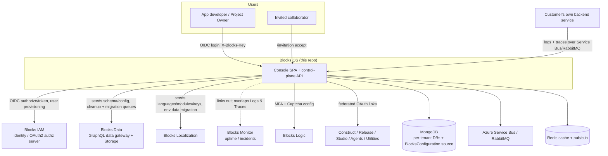
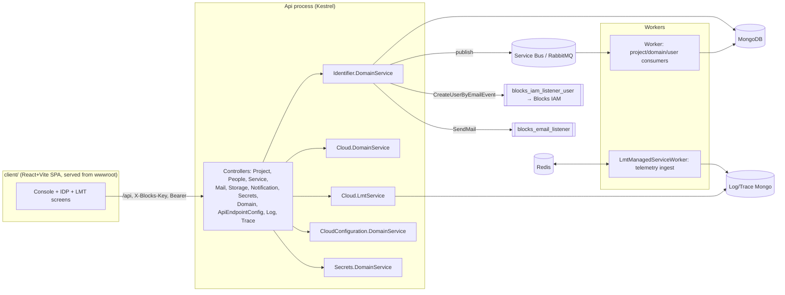
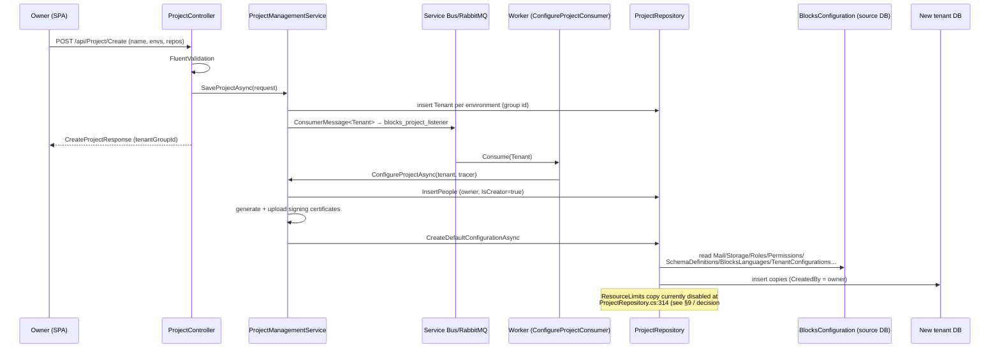
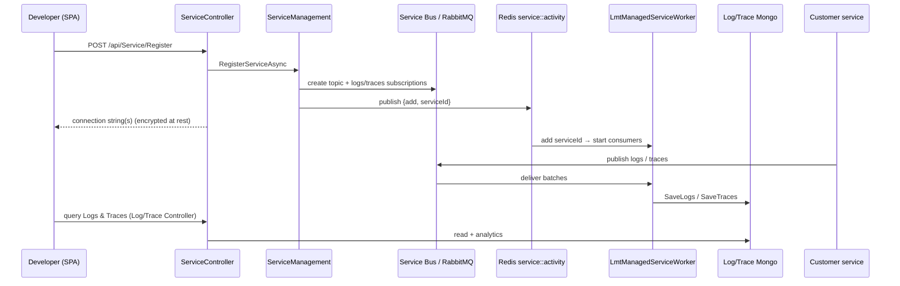

# Blocks OS — Architecture Specification

> Status: authoritative specification. Grounded in the `blocks-os` codebase (`server/` .NET + `client/` React/Vite) and reconciled against the answered-ticket decisions captured in `DECISIONS-blocks-os.md`. Where the shipped code diverges from an authoritative product decision, the decision is treated as the **target state** and the gap is called out explicitly (see §9 and inline "**Gap**" notes). Canonical customer-facing terms are used throughout: **Project** (top-level container), **Environment** (an isolated copy of a project), **People** (collaborators you invite), **My Services** (a customer's own registered backends), and **Managed Services** (platform capabilities). Internal/persistence identifiers may still use older names (e.g. `TenantGroup`, `blocks-idp`); those are noted where they surface on the wire.

Product name: **Blocks OS** (client `index.html` `<title>`, `appsettings.json` `SwaggerOptions.Title`). It is the customer-facing name for what the backend historically called `blocks-idp` / `Identifier.DomainService`.

---

## 1. System Context

Blocks OS is the **central console (control plane)** of the SELISE Blocks platform. It is where a developer or team creates a **Project**, splits it into named **Environments** (each a fully isolated tenant with its own database, signing certificates, domain, default admin and seeded configuration), invites **People**, connects GitHub repositories, registers their own backend services ("**My Services**") for telemetry, configures the per-environment plumbing (identity, secrets, storage, email, notifications, custom domains, API-endpoint security), and observes the environment through **Logs & Traces** (the console area historically labelled "LMT").

Blocks OS is the **hub and provisioning layer** beneath the other four platform services. It does not replace them; it creates the tenants they operate in and embeds (or links to) their admin UIs. Identity itself (users, roles, permissions, OIDC/SSO, MFA) is delivered by **Blocks IAM** — the console is a front door and provisioner for it. The `Iam.DomainService` / `Iam.Driver` server projects in this repo are stubs; IAM logic lives in the `blocks-iam` repo.



**Role in the platform.** At deploy time the console SPA is fed runtime base-URLs, OAuth client-ids and callbacks for every sibling service (`Program.cs` `ApplyFrontendRuntimeSettings` → client `endpoint.constant.ts`), so the single console federates via OIDC across IAM, Data, Localization, Logic, Monitor, Release, Studio, Agents and Utilities. On project creation the backend seeds default data into each new tenant and publishes lifecycle events onto per-service message queues.

---

## 2. Component Architecture

The repository ships **two runnable .NET processes plus a React SPA**, backed by MongoDB, a message bus (Azure Service Bus or RabbitMQ) and Redis. The SPA is built by Vite into the API's `wwwroot` and served by the same Kestrel process (`Dockerfile`), so console + API are one deployable; the Worker and the LMT ingestion worker are separate deployables.

- **Api** (`server/Api`) — ASP.NET Core host. All controllers, Swagger, the `GlobalApiRoutePrefixConvention("api")` (every route is under `/api`), static-file serving of the SPA, and `ApplyFrontendRuntimeSettings` (token-replaces `__BLOCKS_*__` placeholders in the built assets from the Mongo `Secrets` document / env vars). Registers the domain-service DI modules: `AddApplicationServices` (Identifier), `AddCloudDomainServices`, `AddCloudLmtServices`, `AddCloudConfigurationServices`, and the Secrets services.
- **Identifier.DomainService** — the core domain: **Project** (create/provision, update, disable/restore, assets, token-validation params, 3rd-party JWT claims), **People** (invite/confirm/resend/remove/transfer), **ManagedService** ("My Services" registration → telemetry topics), **Certificate**, **Subscription** (resource limits / usage read model), and **Shared** (entities, DTOs, `DomainManagementService` for custom domains, `IdentifierConstants` with all queue names).
- **Cloud.DomainService** — API-endpoint security config ("API Settings").
- **Cloud.LmtService** — read/query side of Logs & Traces (`TraceRepository`, `LogRepository`, analytics) backing `TraceController` / `LogController`.
- **CloudConfiguration.DomainService** — per-tenant Mail / Storage / Notification provider configuration.
- **Secrets.DomainService** — per-tenant secrets vault (`SecretManagementService` / `SecretRepository`).
- **Authentication / Captcha / Mfa (+ .Driver)** — supporting driver projects; Captcha/MFA admin screens call **Blocks Logic** at runtime, not these stubs.
- **Worker** (`server/Worker`, `Dockerfile.worker`) — message consumers that complete project setup and lifecycle asynchronously: `ConfigureProjectConsumer`, `RestoreProjectConsumer`, `CreateUserByEmailPostConsumer`, `DomainConfigureConsumer`, `DisableDomainBindingConsumer`, `UpdateResourceUsageConsumer`. Also `PeriodicPingBackgroundService`.
- **LmtManagedServiceWorker** — standalone ingestion worker. Subscribes to a Redis `service::activity` channel; for each registered service it spins up per-service Service Bus subscriptions (`logs`/`traces`) or RabbitMQ consumers and writes into the log/trace Mongo databases.
- **client** (`client/app`) — React 19 + Vite SPA: `pages/` (console, create-project, environments, people, repositories, settings, subscription-usage, lmt), `idp/` (IAM/OIDC/roles/permissions/api-settings screens over IAM & Logic), `cross-modules/` (identifier, lmt, storage, communication, devops), routing in `router.tsx`, HTTP via `@seliseblocks/blocks-kit` `HttpClient`.



---

## 3. Key Runtime Flows

### 3.1 Create a Project (async provisioning)

`ProjectController.Create` validates, persists one **Tenant per selected environment** under a shared group id, and publishes to `blocks_project_listener`. The **Worker** finishes setup idempotently, tracking progress in a `ProjectStatusTracer` so a crash is resumable (`RestoreUnfinishedProjectAsync`). Certificates are generated and uploaded, the creator is inserted as the owner `ProjectPeople` (`IsCreator = true`), and default configuration is copied from the platform `BlocksConfiguration` source DB into the new tenant DB.



### 3.2 Invite a Person (cross-service, IAM-provisioned)

`PeopleController.Invite` (Owner-gated via `blocks-os::people::invite`) creates per-environment `ProjectPeople` grants. If the invitee has no IAM account, IAM is asked to create one and mint an activation key (`CreateUserByEmailEvent` → `blocks_iam_listener_user`); an invitation email is queued (`blocks_email_listener`) with an `/invitation?code=…` link, and the redemption code is cached with a bounded lifetime. **Gap:** decision #324 fixes the collaborator-invite link at **1 hour** (distinct from the IAM activation-email expiry), whereas `PeopleService` currently defaults to `People:InvitationLifetimeInMinutes` (fallback `60*24`) and clamps to the IAM key lifetime — see §9.

```mermaid
sequenceDiagram
    participant O as Owner (SPA)
    participant API as PeopleController
    participant PS as PeopleService
    participant IAMQ as blocks_iam_listener_user
    participant IAM as Blocks IAM
    participant MAILQ as blocks_email_listener
    participant CACHE as Redis
    participant I as Invitee

    O->>API: POST /api/People/Invite (emails, environments, roles)
    API->>PS: InvitePeoplesAsync
    PS->>PS: create ProjectPeople per environment
    alt invitee has no IAM user
        PS->>IAMQ: CreateUserByEmailEvent
        IAMQ->>IAM: create account + activation key
    end
    PS->>MAILQ: SendMail (ProjectInvitationLink /invitation?code=…)
    PS->>CACHE: cache code → {ids, activationKey, group} (bounded TTL)
    MAILQ-->>I: invitation email
    I->>API: POST /api/People/ConfirmInvitation (code)
    API->>PS: redeem code, activate access
    Note over API: ConfirmInvitation carries no auth attribute today;<br/>decision #327 = make intent explicit ([AllowAnonymous] or scoped)
```

### 3.3 Register "My Service" and stream Logs & Traces

`ServiceController.Register` (`blocks-os::service::register`) provisions per-service messaging: on Azure it creates a Service Bus **topic** with `logs`/`traces` subscriptions and returns a scoped (encrypted-at-rest) connection string; on RabbitMQ it returns the shared broker connection and the customer's service publishes to an `lmt-<serviceId>` exchange. The customer's app (via `SeliseBlocks.LMT.Client`) publishes logs/traces; the **LmtManagedServiceWorker**, notified over the Redis `service::activity` channel, subscribes per service and persists into the log/trace Mongo DBs. `TraceController` / `LogController` serve the query and analytics side to the **Logs & Traces** screens.



---

## 4. Data Architecture

**Storage engine.** MongoDB is the system of record throughout (`AddMongoDbConfiguration`, `IMongoDatabase` access in repositories). The message bus provider is chosen at runtime from the connection-string scheme (`amqp(s)` → RabbitMQ, otherwise Azure Service Bus; `IdentifierConstants.GetMessageConfiguration`). Redis provides caching (invitation codes) and pub/sub (`service::activity`, notifications).

**Per-tenant isolation.** Each **Environment is a Tenant with its own MongoDB database** (`project.DBName`). Tenant metadata lives in root collections (`Tenants`, `TenantAssets`, `ProjectPeoples`, `ProjectStatusTracers`, `MigrationTrackers`, `ThirdPartyJWTClaims`, `BlocksManagedServices`, `ResourceLimits`), while application/config data (roles, permissions, schema definitions, mail/storage config, languages, secrets) lives inside the tenant's own DB. A dedicated **`BlocksConfiguration`** database holds the golden defaults copied into every new tenant.

**Seed/copy on provisioning** (`ProjectRepository.InitializeDefaultConfigurationsAsync`) copies these collections from `BlocksConfiguration` into the tenant DB, stamping `CreatedBy`/`LastUpdatedBy`:

- Platform config: `MailServerConfigurations`, `EmailTemplates`, `StorageConfigurations`, `TenantConfigurations`, `LinkBasedActionConfigs`, `DmsArtifacts`
- Identity: `Roles`, `Permissions`, plus a customized identity configuration (`CopyAndCustomizeIdentityConfigurationAsync`)
- Blocks Data: `SchemaDefinitions`
- Blocks Localization: `BlocksLanguages`, `UilmFiles`, `BlocksLanguageModules`, `BlocksLanguageKeys`
- **Gap:** `CopyAndCustomizeResourceLimitsAsync` is commented out at `ProjectRepository.cs:314`, so per-tenant `ResourceLimits` are not seeded on create today (decision #325 Issue B: re-enable it).

**Resource limits model.** `ResourceLimit` (collection `ResourceLimits`) is the data-driven quota record — fields `Resource`, `ResourceType`, `Limit`, `Usage`, `Lifetime`, `IsActive`, `EnableAutoRenew`, `TenantId`, `Type`. Per decision #325, limits are intentionally **data-driven per tenant** (not code constants) so they can become subscription-based later without a code change, and cover project, environment and **people/seat** quotas. The seat quota is what gates invitations. `UpdateResourceUsageConsumer` maintains usage; `SubscriptionRepository` reads the set for the usage view.

**Environment-to-environment data migration.** `MigrationTrackers` track async copies between environments per service, coordinated over `blocks_generic_migration_listener` / `blocks_uilm_environment_data_migration_listener` / `blocks_data_cleanup_listener`, with completion signalled on `migration_topic`.

---

## 5. AuthN/AuthZ Architecture

**Tenant identification — `X-Blocks-Key`.** Every request carries the tenant key in the `X-Blocks-Key` header. The SPA's shared `HttpClient` is constructed with `blocksKey` from the runtime env (`http-client.ts`), and the OIDC flow and impersonated-environment calls set it explicitly per request (`oidc-auth-flow.service.ts`). The root/platform tenant is `RootTenantId` in `appsettings.json`.

**OIDC / token flow.** Authentication is delegated to **Blocks IAM** as the OAuth2/OIDC authorization server. The SPA obtains the OIDC client config, drives the authorize + user-acknowledgement (consent) flow, and exchanges/refreshes tokens at `${BLOCKS_IAM_BASE_URL}/api/auth/Token` (`grant_type=refresh_token`), always sending `X-Blocks-Key`. Tokens are held in `oidc-auth-storage`; a 401 triggers a silent refresh-and-retry. The console federates the same OIDC identity to sibling products via their configured client-ids/callbacks.

**Authorization scopes.** API methods are gated by Genesis's `[ProtectedEndPoint("…")]` attribute. The canonical grammar (decision #334) is **`service::area::action`** (3 segments, kebab-case action), with the `blocks-os` prefix derived from the service identity. Representative scopes in use: `blocks-os::project::mutate-project`, `blocks-os::project::projects`, `blocks-os::people::invite`, `blocks-os::people::transfer-owner`, `blocks-os::service::register`, `blocks-os::mail::save`, `blocks-os::storage::gets`, `blocks-os::notification::delete`, `blocks-os::trace::gets`. Some controllers are deliberately coarser:

- `SecretsController`, `ApiEndpointConfigController`, `DomainController` are `[Authorize]`-only (authenticated but not finely scoped). Decision #327 confirms this is **intentional for now**; scoped authz for Secrets is deferred to the Secrets Management Epic.
- `PeopleController.ConfirmInvitation` currently has **no** auth attribute. Decision #327: make the intent explicit (`[AllowAnonymous]` if public, else a scope).

**Ownership.** The project **Owner** is the creator (`ProjectPeople.IsCreator`), not a stored role. Invite / remove-access / transfer-ownership are Owner-gated. `blocks-os::*` permission catalog seeding is handled **outside** this repo (decision #326).

**Gaps flagged for §9:** `LogController`'s three endpoints are gated by `blocks-os::mail::gets` instead of a log scope (decision #279 target `blocks-os::log::gets`, requiring a coordinated per-tenant grant migration); and the Swagger `ServiceName` is still `blocks-idp` rather than `blocks-os` (decision #331).

---

## 6. Deployment Architecture

**Containers.** Two images: the **Api** image (`Dockerfile`) is a multi-stage build — `node:22-alpine` builds the Vite client into `server/Api/wwwroot`, then `dotnet/sdk:10.0` publishes `Api.csproj`; the runtime image runs Kestrel serving both the API and the static SPA. The **Worker** image is built from `Dockerfile.worker`. The LMT ingestion worker and Worker are console/background services.

**Runtime config injection.** Frontend runtime values (`BLOCKS_*_BASE_URL`, client-ids, callbacks, `X-Blocks-Key`, site keys) are **not** baked into the client bundle; `ApplyFrontendRuntimeSettings` token-replaces `__BLOCKS_*__` placeholders in the served assets at startup from the Mongo `Secrets` document (`SecretKey "blocks-secret-os"`, section `FrontendRuntime`), overridable by `FrontendRuntime__BLOCKS_*` env vars. Secrets themselves come from a Genesis vault (`ResolveVaultType`, on-prem or Azure).

**CI/CD.** GitHub Actions, one workflow per tier: `ci-dev.yml`, `ci-stg.yml`, `ci_prod.yml`. Each runs an `initialization` job (shared config via `blocks-inventory/setvars`), optional SonarQube and SCA scans, then **build-push** of the client and worker images (reusable `build-push.yml`) and **`update-gitops-central.yml`** to bump image tags in a GitOps repo — i.e. deployment to the target Kubernetes cluster is GitOps-driven (cluster name is a configured output). The build/push and GitOps update are the deploy mechanism; there are no in-repo Helm/kubectl manifests.

**Environment tiers.** Product-level, a Project offers eight fixed environment tiers (`environment-options.ts`): Development, Testing, Staging, IAT, UAT, Prod Shadow, Pre-Prod, Production — each provisioned as its own tenant. Separately, the platform's own delivery tiers are dev / stg / prod (the three CI workflows and `appsettings.{dev,stg,prod}.json`).

**Test gate.** Each workflow carries a `RUN_TESTS` flag (`true` in dev, `false` in stg/prod) but the PR test job that would consume it is **commented out** in all three files. Decision #341 (target): enable the gate via `RUN_TESTS`, adding a PR-only job running backend `dotnet test server/XUnitTest/XUnitTest.csproj` and frontend `npx vitest run`. Decision #323 (target): a permanent, blocking **50% coverage floor** for both backend and frontend, CI-only (never gating local build).

---

## 7. Cross-Service Dependencies

**What Blocks OS needs from others:**

- **Blocks IAM** (hard dependency) — OIDC/OAuth2 authorization server for all console auth and token refresh; account creation and activation-key minting for invitations (`blocks_iam_listener_user`); the roles/permissions/users/organizations/OIDC/SSO admin screens are UIs over `${BLOCKS_IAM_BASE_URL}`. IAM logic is not in this repo.
- **Blocks Logic** — serves **MFA** and **Captcha** configuration screens (`${BLOCKS_LOGIC_BASE_URL}`), i.e. those security settings are surfaced in the console but handled by Logic.
- **Blocks Data** — consumes seeded `SchemaDefinitions` / `TenantConfigurations`; cleanup and migration are coordinated via `blocks_data_cleanup_listener` and generic migration queues.
- **Blocks Localization** — consumes seeded `BlocksLanguages` / `UilmFiles` / `BlocksLanguageModules` / `BlocksLanguageKeys`; environment data migration moves language data via `blocks_uilm_environment_data_migration_listener`.
- **Infrastructure** — MongoDB (incl. the `BlocksConfiguration` source DB), Azure Service Bus **or** RabbitMQ, Redis, a Genesis secrets vault, and (for custom domains) SSH-reachable nginx reverse-proxy hosts with certbot.

**What depends on Blocks OS:**

- **Every new tenant** is provisioned by Blocks OS (its DB, certificates, default roles/permissions/config), so all sibling services operate inside tenants OS created.
- **Customers' own backend services ("My Services")** depend on OS for telemetry: registration provisions their logging/tracing topics and connection strings, and OS ingests and serves their logs and traces.
- **Blocks Monitor** overlaps the console's **Logs & Traces** area. Decision #339: OS renders no metrics and none are planned in OS; the area is a **Logs & Traces** view, not a monitoring product. (Related fix in #339 lives in the monitor repo: correct `serviceAccessResourceName 'blocks-os' → 'blocks-monitor'`.)

---

## 8. Scalability, Reliability & Observability

**Scalability.** The Api process is stateless (tokens client-side, tenant selected per request via `X-Blocks-Key`), so it scales horizontally behind the cluster ingress; the SPA is static assets served from the same process. Heavy and slow work is offloaded to the **Worker** (provisioning, certificates, domain configuration, resource-usage updates) via the message bus, decoupling the request path from multi-second provisioning. **Telemetry ingestion scales per service**: the LmtManagedServiceWorker maintains one consumer set per registered service (Service Bus subscriptions or RabbitMQ channels), added/removed live via the Redis `service::activity` channel, with bounded prefetch/concurrency (Azure `MaxConcurrentCalls=2`, `PrefetchCount=20`; RabbitMQ QoS prefetch 20).

**Reliability.** Project provisioning is **idempotent and resumable**: `ProjectStatusTracer` records each completed step (people inserted, certificates uploaded, project updated, default config copied) and `RestoreUnfinishedProjectAsync` re-drives incomplete projects after a crash. Message consumers use explicit ack/abandon (Azure `AutoCompleteMessages=false`, abandon-with-retry) and nack-with-requeue (RabbitMQ), so a transient failure re-delivers rather than drops. RabbitMQ connections use automatic recovery. The bus provider is abstracted so the same code runs on Azure Service Bus or RabbitMQ.

**Observability.** Logs & Traces is the platform's own observability surface: registered services stream structured logs and distributed traces into dedicated Mongo log/trace databases, queryable through the console with live-tail (`LogController.Live`) and API analytics (`TraceController` operational/service analytics). **Gap:** `TraceController.GetTraces`/`GetTrace` return `Task<object>`, so Swagger documents no schema — decision #332 targets typing those two to their concrete return types (the analytics endpoints stay `object`, genuinely dynamic). Health checks are registered (`AddHealthChecks`). Coverage/test gating is covered in §6.

---

## 9. Architectural Decisions & Trade-offs

ADR-style. Each records the decision, its context, and the consequence; several note a **gap** between shipped code and the authoritative target.

**ADR-1 — Environment = isolated tenant with its own database.**
*Context:* strong data/security isolation between dev→prod copies of a project. *Decision:* every environment is a separate MongoDB database with its own signing certificates, domain and seeded config, copied from a golden `BlocksConfiguration` DB. *Consequence:* clean blast-radius isolation and per-environment config, at the cost of N databases per project and a non-trivial provisioning pipeline (mitigated by the resumable Worker). Canonical terms: **Project** (container) and **Environment** (the tenant); internal identifiers may still say `TenantGroup`.

**ADR-2 — Asynchronous, resumable provisioning.**
*Context:* project setup is slow (certs, seeding, domains). *Decision:* the API returns immediately after persisting tenants and enqueuing `blocks_project_listener`; the Worker completes setup and records progress in `ProjectStatusTracer`. *Consequence:* fast UX and crash-resumability; the trade-off is eventual consistency (the project is usable only once the Worker finishes) and the need for status surfacing in the UI.

**ADR-3 — Identity delegated to Blocks IAM; console is front door + provisioner.**
*Context:* avoid duplicating an OAuth2/OIDC authorization server. *Decision:* IAM owns users/roles/permissions/OIDC/SSO/MFA-accounts; OS embeds the admin UIs and provisions defaults. The `Iam.*` server projects here are stubs. *Consequence:* one identity source of truth, but identity UX is split across services (and MFA/Captcha further split to **Blocks Logic**), which the console must present as one place.

**ADR-4 — Data-driven, per-tenant resource limits (not hardcoded).**
*Context:* limits must be able to become subscription-based later without code changes, and be transparent before failure (decision #325). *Decision:* a `ResourceLimits` collection per tenant (`Limit`/`Usage`/`Lifetime`/`EnableAutoRenew`), with the people/seat quota gating invitations. *Consequence:* limits are configurable per tenant and surfaced on the usage/creation/invitation entry points. **Gap:** `CopyAndCustomizeResourceLimitsAsync` is disabled at `ProjectRepository.cs:314`, so new tenants aren't seeded with limits yet (Issue B, one PR); the usage page's LIMIT column should be wired to live per-tenant data while usage stays sample until real usage lands.

**ADR-5 — Telemetry is opt-in per registered service; OS ingests Logs & Traces itself.**
*Context:* provide built-in observability without customers standing up a stack. *Decision:* "My Services" registration provisions per-service topics/subscriptions and a scoped connection string; a dedicated worker ingests into Mongo. *Consequence:* isolation and per-service scaling, but observability is opt-in per service (nothing is monitored until registered). Related terminology decision #339: the console area is **Logs & Traces** (no metrics), not "LMT" and not a Monitor replacement. **Gap:** UI still labelled "LMT".

**ADR-6 — Single canonical response envelope, evolved additively in Genesis.**
*Context:* consistent responses across repos without churn (decision #336). *Decision:* keep the shared `SeliseBlocks.Genesis` `BaseResponse` (`IsSuccess`, `Errors`, `ItemId`) and extend it additively with an optional structured `ValidationErrors` field; FluentValidation maps into it while still filling `Errors`. *Consequence:* backward-compatible cross-repo contract; the cost is lockstep Genesis versioning (release before any repo migrates).

**ADR-7 — Runtime frontend config injection over build-time baking.**
*Context:* one client build must serve many environments/tiers. *Decision:* `ApplyFrontendRuntimeSettings` token-replaces `__BLOCKS_*__` placeholders at startup from the Mongo `Secrets` doc / env vars. *Consequence:* one immutable image redeployable across tiers; the trade-off is a startup rewrite pass over `wwwroot` and a placeholder discipline in the client.

**ADR-8 — Coarse `[Authorize]` on high-risk controllers, deferred to dedicated refactors.**
*Context:* Secrets/API-settings/Domain are high-risk and need a proper authz model, not a rushed scope (decision #327). *Decision:* keep them `[Authorize]`-only for now; Secrets scoping moves to the Secrets Management Epic. *Consequence:* pragmatic, but a known coarse-grained gap. Related: `ConfirmInvitation` must be given explicit `[AllowAnonymous]`-or-scoped intent.

**ADR-9 — Permission-scope grammar `service::area::action`, kebab-case, derived prefix.**
*Context:* five repos drifted on scope grammar (decision #334). *Decision:* canonical 3-segment kebab-case scopes with the `blocks-os` prefix derived from the corrected service identity; phased/non-breaking where the derived value already matches. *Consequence:* consistency, but blocks-os is sequenced behind the identity fix. **Gap:** Swagger `ServiceName` is still `blocks-idp` (decision #331 target `blocks-os`); `LogController` still uses `blocks-os::mail::gets` (decision #279 target `blocks-os::log::gets`, which needs a **coordinated per-tenant grant migration shipped with the code change** or tenants lose log access on deploy).

**ADR-10 — Repo-local customer-term renames; internal identifiers deferred.**
*Context:* customer-facing terms drifted from persistence names (decisions #329, #330, #333). *Decision:* rename customer-facing surfaces now — **My Services** (plural) at `/app/secret-management/my-services` with a redirect from `/managed-services`; the project rename off "tenant group" (endpoint/route/DTO/client) shipped backend+frontend together since the API is only consumed in-repo — while deferring internal `TenantGroup`/service identifiers. The wire misspelling `Enviroment`/`SharedEnviroments`/`EnviromentDetails` is corrected as a coordinated cross-repo contract migration (with blocks-data + blocks-iam). *Consequence:* clean customer language with compatibility redirects; internal churn is deferred. **Gap:** shipped code still shows `My Service` (singular) at `/managed-services`, `UpdateTenantGroup`, and the `Enviroment` misspelling on the wire.

---

### Open / undecided

- **Live-log scope split (#279):** whether the live-log endpoint gets its own `blocks-os::log::get-live` scope or all three log endpoints share `blocks-os::log::gets` is **not yet confirmed**.
- **Subscription/billing:** the Subscription Usage screen is a preview; whether real billing/quota enforcement beyond the seat quota exists today is **open** (usage numbers stay sample until #305).
- **Custom-domain ownership:** custom-domain binding mutates SSH-reachable nginx/certbot proxy hosts; the operational ownership and turnaround/SLA of those hosts is **not specified** in this repo.
